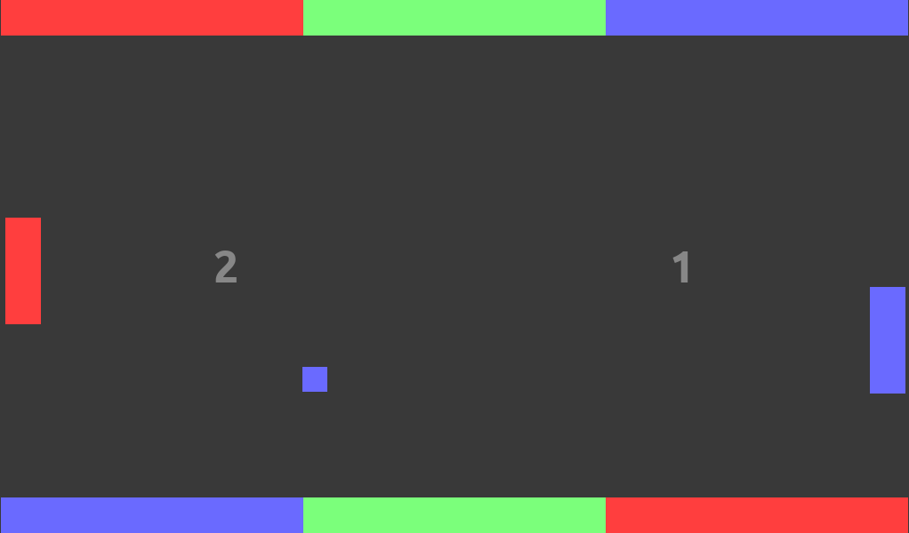

# RGB Pong

Pong videogame with color mechanics made for [the first #RetoGamedev](https://itch.io/jam/1-retogamedev).

Project boilerplate generated from [godot-game-boilerplate](https://github.com/moisesjbc/godot-game-boilerplate).

## About

### Mechanics

RGB Pong is a Pong with color mechanics.

1. Every time the ball hits a colored wall, it will take the color of the wall
2. Players can change the color of their paddles.
3. Ball will only collide with the paddle if both have the same color.

The first player to get 3 points wins!

### Controls

#### Player 1

- W, S: move paddle up / down
- G, H, J: change paddle color

#### Player 2

- Up arrow, down arrow: move paddle up / down
- 1, 2, 3 (numpad): change paddle color

## Credits

### Idea, programming, graphics and sound

- Moisés J. Bonilla Caraballo ([Personal website](https://moisesjose.com/))

### Third-party work used

- [Godot Engine](https://godotengine.org/)
- [Ubuntu Font](https://design.ubuntu.com/font/)

## Exporting (Linux only)

1. Set the environment variable to a path pointing to Godot Engine executable. ie.

        export GODOT_EXECUTABLE=<path-to-godot-engine>

    For example:

        export GODOT_EXECUTABLE=/opt/godot-engine/Godot_v3.0.6-stable_x11.64

2. Run the export script. Packages will be generated in `export/` and `export/zip` directories.

        bash export.sh <game-name> <version>

    For example:

        bash export.sh awesome-game v1.0
